# MediTrack — Open-Source Medical Practice Management with AI Clinical Assistant

[](LICENSE)
[](https://dotnet.microsoft.com/)
[](https://react.dev/)
[](https://www.typescriptlang.org/)
[](https://www.postgresql.org/)
[](https://docs.docker.com/compose/)
[](https://github.com/sponsors/nkmnhan)

> An **MCP-native EMR platform** with an AI clinical companion (**Clara**) that listens to doctor-patient conversations in real time, transcribes visits, suggests diagnoses, and auto-generates SOAP notes — so doctors can **focus on care, not clicks**.

Built with microservices architecture, MCP (Model Context Protocol), HIPAA-compliant patterns, and modern full-stack technologies.

> **Educational Project**: Personal learning project for full-stack development, AI integration, and healthcare data standards. Not intended for production use with real patient data.

---

<p align="center">
  <strong>If this project helped you learn something or saved you time — consider sponsoring!</strong><br/>
  <a href="https://github.com/sponsors/nkmnhan">
    
  </a>
</p>

---

### Links

| | |
|---|---|
| **Live Design Preview** | [meditrack-styleguide.lovable.app](https://meditrack-styleguide.lovable.app) |
| **Design System (Lovable)** | [lovable.dev/products/meditrack-styleguide](https://lovable.dev/products/meditrack-styleguide) |
| **Repository** | [github.com/nkmnhan/meditrack](https://github.com/nkmnhan/meditrack) |

### Table of Contents

- [Features](#features)
- [Screenshots](#screenshots)
- [Architecture](#architecture)
- [Tech Stack](#tech-stack)
- [Services](#services)
- [Quick Start](#quick-start)
- [Commands](#commands)
- [Roadmap](#roadmap)
- [Documentation](#documentation)
- [Contributing](#contributing)
- [License & Disclaimer](#license--disclaimer)

---

## Features

- **Clara AI Clinical Companion** — Real-time AI assistant that listens to consultations via speech-to-text, provides live clinical suggestions (urgent alerts, medication, guidelines), and auto-generates SOAP notes
- **Doctor Dashboard** — At-a-glance view of patients, appointments, pending records, Clara sessions, and today's schedule with quick actions
- **Patient Management** — Full CRUD with search, filtering, and detailed patient profiles
- **Appointment Scheduling** — Create, manage, and track appointments with status workflows
- **Medical Records (DDD)** — Domain-driven medical records with encounter management and FHIR-ready data models
- **Admin Dashboard** — System-wide analytics: FHIR sync status, Clara acceptance rate, appointment volume, API performance monitoring
- **Reports & Analytics** — AI suggestion acceptance funnel, department comparison, peak usage heatmaps, session metrics
- **Role-Based Access Control** — Duende IdentityServer with OAuth 2.0, OIDC, MFA-ready, and granular RBAC (Doctor, Admin, Nurse, Patient roles)
- **Event-Driven Architecture** — RabbitMQ-based integration events with outbox pattern for reliable messaging
- **Observability** — OpenTelemetry tracing, Jaeger, Prometheus metrics, audit logging
- **10 Curated Color Themes** — Perceptual color scale engine generates 100+ CSS variables from 5 brand colors. Dark palettes (Northern Lights, Velvet Night, Emerald Forest, Luminous Flow, Dreamscapes) + light palettes (Mimi Pink, Baby Blue Summer, Health Summit, French Riviera, Ethereal Escapes). Every badge, chart, and status indicator auto-adapts.

---

## Screenshots

### Doctor Dashboard
> At-a-glance overview: patients, appointments, pending records, Clara sessions, today's schedule, and AI-powered clinical suggestions.

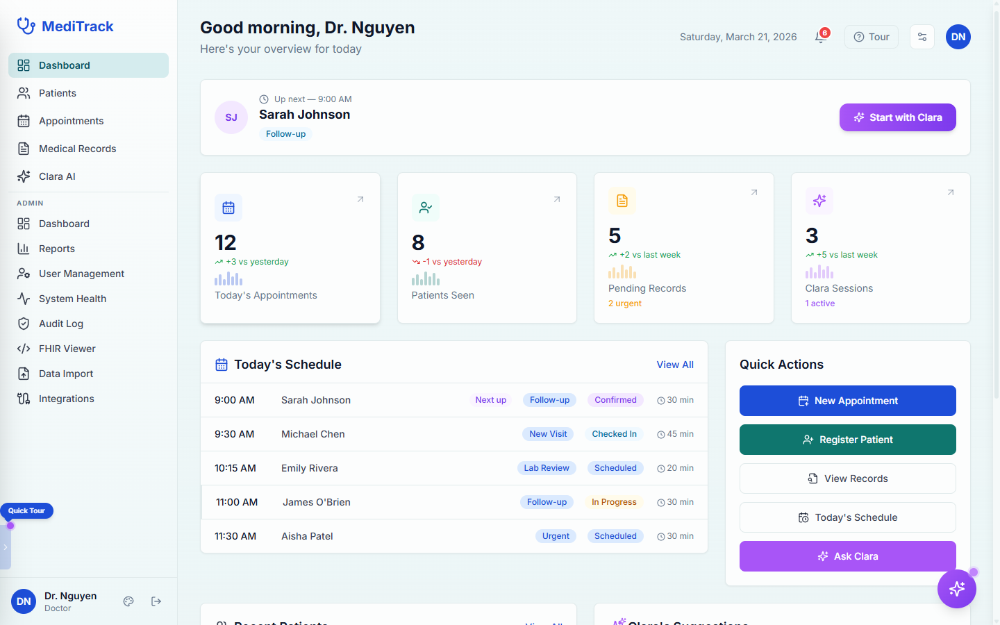

### Appointment Calendar
> Weekly calendar view with color-coded appointment types (Consultation, Follow-up, Urgent, Telehealth, New Patient). Hover for details, drag to reschedule, filter by provider.

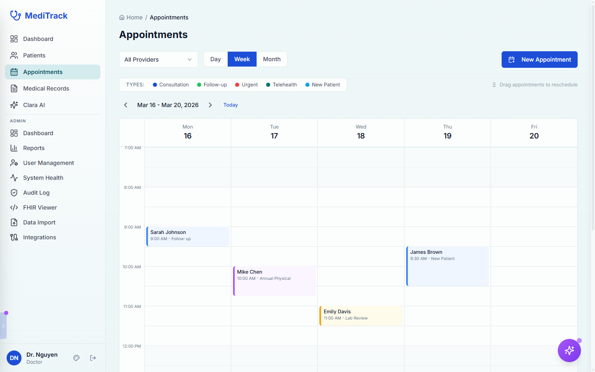

### Clara AI — Start Session
> Link a patient, choose session type (Consultation, Follow-up, Review), select a template, and start a session with Clara. View upcoming appointments with one-click "Start with Clara".

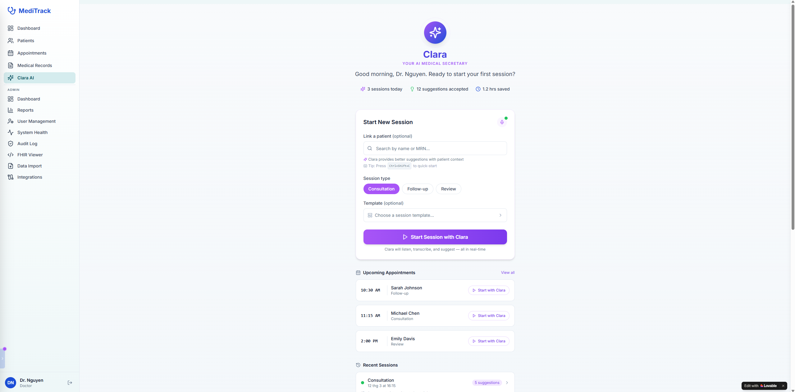

### Clara AI — Live Consultation
> Real-time transcript with speaker diarization (Doctor/Patient). Clara provides live suggestions: urgent alerts, medication recommendations, clinical guidelines, and follow-up actions.

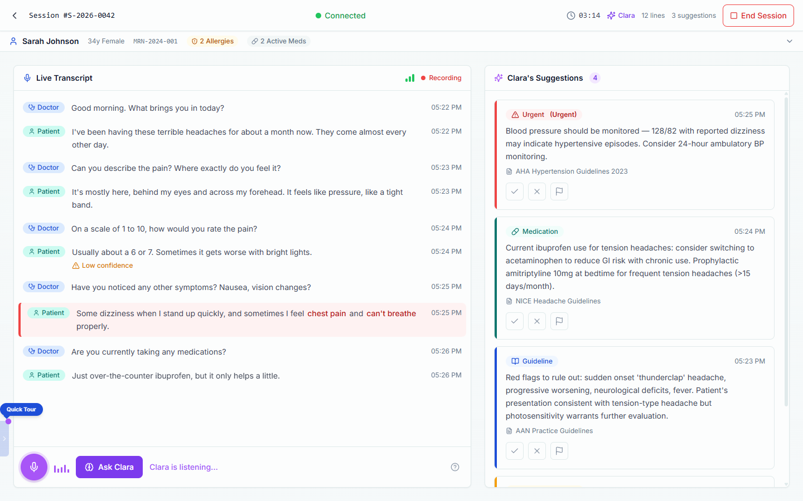

### Clara AI — Review AI-Generated Draft
> Review the AI-generated medical record draft (82% note quality). Edit key patient statements, view Clara's suggestions with accept/reject/flag actions, and save as the official medical record.

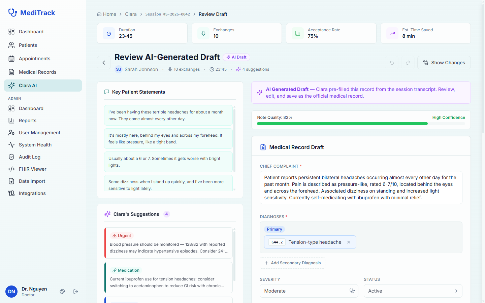

### Landing Page
> Full marketing landing page with hero section, interactive Clara demo, feature grid, tech stack showcase, testimonials, and waitlist capture.

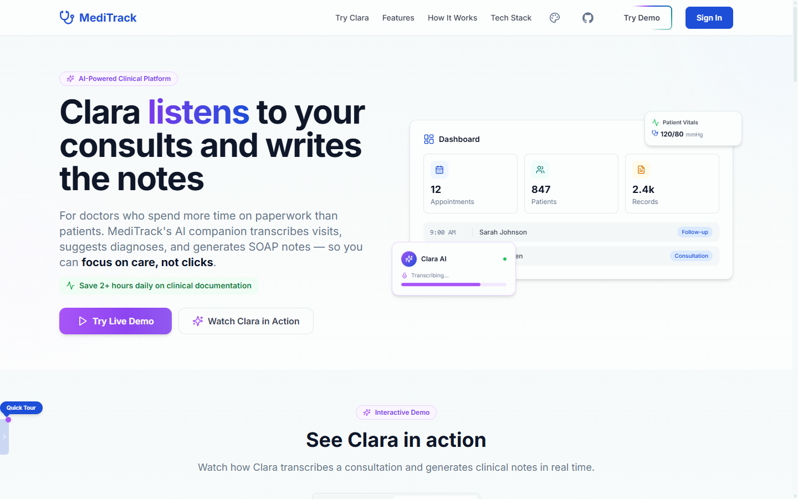

### Admin Dashboard
> System-wide analytics: 3,247 patients, FHIR sync health, Clara acceptance rate (76.3%), appointment volume by status, live activity feed, and API performance.

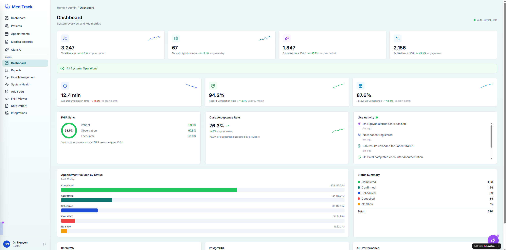

### Reports & Analytics
> AI suggestion acceptance funnel, department comparison, peak usage heatmaps, and Clara session metrics across all providers.

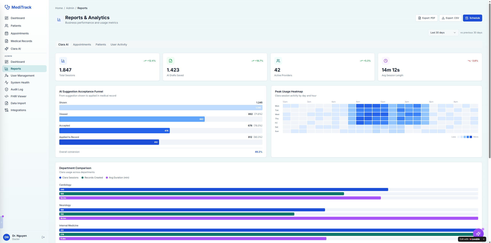

### Theme Showcase
> 10 curated color themes with perceptual color scales. Every component — badges, charts, status indicators, sidebar — adapts automatically. Switch themes from the sidebar palette icon.

**Dark Themes**

| Default (Deep Ocean) | Northern Lights | Velvet Night | Emerald Forest |
|:---:|:---:|:---:|:---:|
| 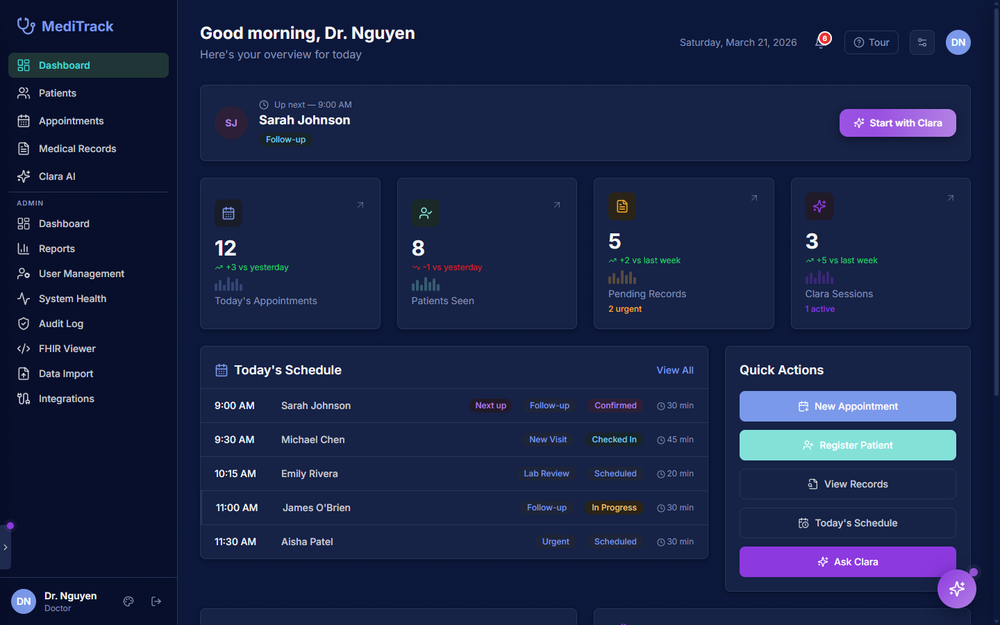 | 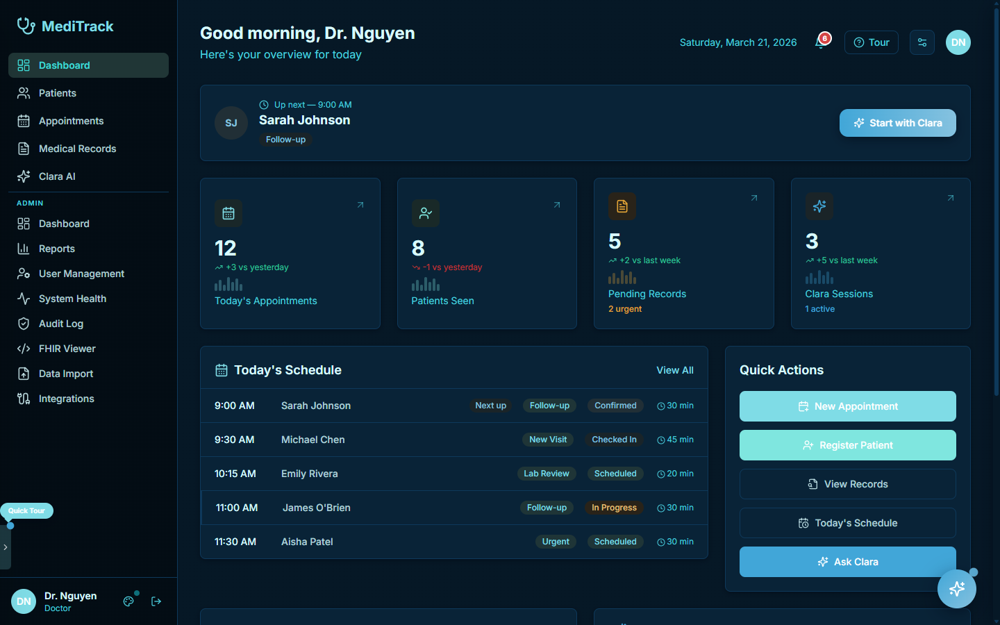 | 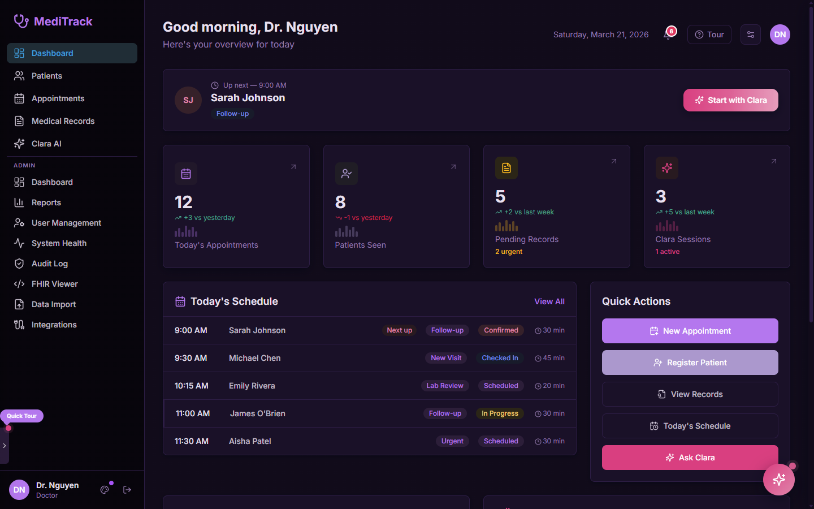 | 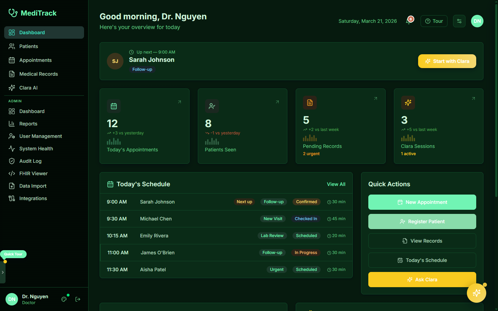 |

**Light Themes**

| Default (Light) | Mimi Pink | French Riviera |
|:---:|:---:|:---:|
| 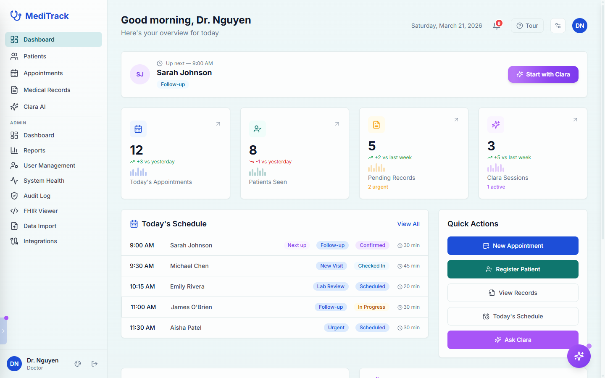 | 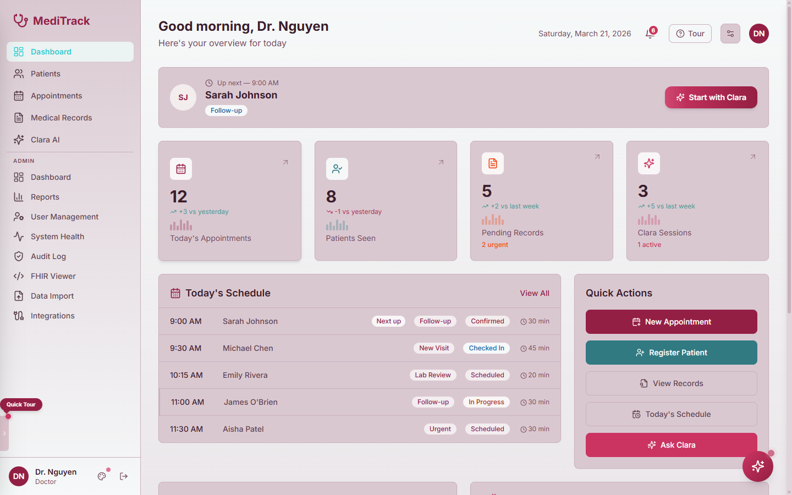 | 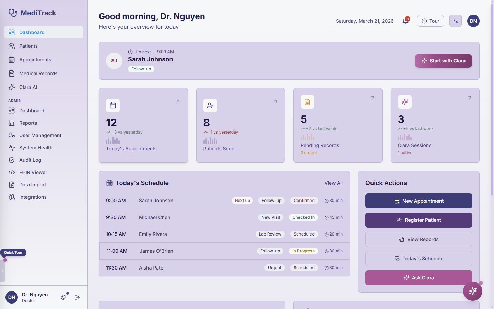 |

**Theme Switcher**
> Click the palette icon in the sidebar to pick from 10 palettes + light/dark/system modes.

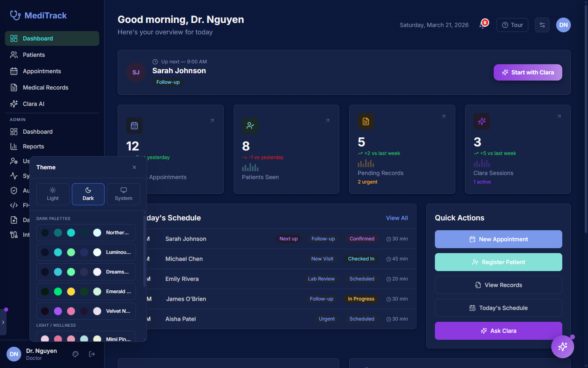

---

## Architecture

```
┌──────────────────────────────────────────────────────────────┐
│                    React Frontend (Vite)                      │
│    Doctor Dashboard · Clara · Admin Panel · Patient UI  │
└─────────────────────────┬────────────────────────────────────┘
                          │ OIDC / JWT + SignalR
┌─────────────────────────▼────────────────────────────────────┐
│                    Identity.API (Duende IS)                   │
│            OAuth 2.0 + RBAC + Token Management               │
└─────────────────────────┬────────────────────────────────────┘
                          │ JWT Bearer
  ┌───────────┬───────────┼───────────┬──────────────┐
  ▼           ▼           ▼           ▼              ▼
Patient   Appointment  MedicalRec  Clara.API      Notification
 .API       .API        .API       (MCP + Agent     .Worker
                                    + SignalR)    (Audit·Alerts)
  │           │           │           │              │
  └───────────┴───────────┴───────────┴──────┬───────┘
                                             ▼
                                    RabbitMQ (EventBus)
```

### How Clara Works

```
Doctor's phone (mic) ──► SignalR ──► Speech-to-Text (diarization)
                                          │
                                    Transcript + speaker labels
                                          │
                              ┌───────────▼────────────┐
                              │  Clara Agent            │
                              │  (MCP Client)           │
                              │  LLM-agnostic via MCP   │
                              └───────────┬────────────┘
                                          │
                              ┌───────────▼────────────┐
                              │    Clara.API            │
                              │  fhir_* · knowledge_*  │
                              │  session_* MCP tools   │
                              └───┬───────────────┬────┘
                                  │               │
                            MediTrack        PostgreSQL
                            Domain APIs      + pgvector
```

> Full architecture details: [docs/architecture.md](docs/architecture.md) · AI design: [docs/medical-ai-architecture-summary.md](docs/medical-ai-architecture-summary.md)

---

## Tech Stack

### Backend
| Package | Purpose | License |
|---------|---------|---------|
| ASP.NET Core (.NET 10) | Web framework | MIT |
| Entity Framework Core | ORM | MIT |
| **Duende IdentityServer** | OIDC / OAuth 2.0 provider | **Commercial** (free < $1M revenue) |
| MediatR | CQRS / Mediator pattern | Apache 2.0 |
| FluentValidation | Input validation | Apache 2.0 |
| AutoMapper | DTO mapping | MIT |
| RabbitMQ.Client | Message bus | Apache 2.0 |
| OpenTelemetry | Observability / tracing | Apache 2.0 |

### Frontend
| Package | Purpose | License |
|---------|---------|---------|
| React 19 + Vite | UI framework + build | MIT |
| TypeScript | Type safety | Apache 2.0 |
| Redux Toolkit + RTK Query | State + server cache | MIT |
| Tailwind CSS + shadcn/ui | Styling + components + 10 themes | MIT |
| React Router v7 | Routing | MIT |
| React Hook Form + Zod | Forms + validation | MIT |
| oidc-client-ts | OIDC authentication | Apache 2.0 |

### AI & Healthcare
| Technology | Purpose | License |
|------------|---------|---------|
| MCP (Model Context Protocol) | LLM-agnostic AI tool protocol | MIT |
| Microsoft.Extensions.AI | LLM-agnostic AI abstraction layer | MIT |
| pgvector | Vector embeddings for RAG knowledge base | PostgreSQL License |
| Deepgram | Speech-to-text transcription | Commercial |
| FHIR R4 | Healthcare interoperability standard (planned) | HL7 |

### Infrastructure
| Tool | Purpose | License |
|------|---------|---------|
| Docker + Docker Compose | Container orchestration | Apache 2.0 |
| .NET Aspire (Aspire.Nexus) | Service orchestration + dashboard | MIT |
| PostgreSQL 17 + pgvector | Database + vector embeddings | PostgreSQL License |
| RabbitMQ | Message broker | MPL 2.0 |

> **Licensing note**: Duende IdentityServer is the only non-free dependency (free for companies < $1M revenue).

---

## Services

| Service | Port | API Prefix | Pattern |
|---------|------|------------|---------|
| Identity.API | 5001 | — | Duende IdentityServer (OIDC + RBAC) |
| Patient.API | 5002 | `/api/patients` | Simple CRUD |
| Appointment.API | 5003 | `/api/appointments` | Simple CRUD |
| MedicalRecords.API | 5004 | `/api/medicalrecords` | Full DDD + CQRS |
| Clara.API | 5005 | `/api/clara` | MCP + SignalR + RAG |
| Web (React SPA) | 3000 | — | Vite dev server |
| Aspire.Nexus | 15178 | — | Service dashboard |

---

## Quick Start

### Prerequisites
- [.NET 10 SDK](https://dotnet.microsoft.com/download)
- [Node.js 20+](https://nodejs.org/) and npm
- [Docker Desktop](https://www.docker.com/products/docker-desktop/)

### Setup

```bash
# Clone and configure
git clone https://github.com/nkmnhan/meditrack.git && cd meditrack
cp .env.example .env  # edit with your POSTGRES_PASSWORD

# Option 1: Aspire.Nexus (recommended — starts all services + dashboard)
dotnet run --project src/Aspire.Nexus --launch-profile http

# Option 2: Docker Compose
docker-compose up -d --build

# Frontend (if running separately)
cd src/MediTrack.Web && npm install && npm run dev

# Seed test data (optional)
dotnet run --project src/MediTrack.Simulator
```

| Service | URL |
|---------|-----|
| Aspire Dashboard | http://localhost:15178 |
| Frontend | https://localhost:3000 |
| Identity Server | https://localhost:5001 |
| Patient API | https://localhost:5002 |
| Appointment API | https://localhost:5003 |
| Records API | https://localhost:5004 |
| Clara API (AI + SignalR) | https://localhost:5005 |
| RabbitMQ UI | http://localhost:15672 (guest/guest) |

> See [docs/SEEDING.md](docs/SEEDING.md) for data generation options.

---

## Commands

```bash
# Aspire.Nexus (recommended — orchestrates all services)
dotnet run --project src/Aspire.Nexus --launch-profile http

# Docker Compose
docker-compose up -d              # Start all services
docker-compose up -d --build      # Rebuild and start
docker-compose down               # Stop all services

# Frontend (src/MediTrack.Web/)
npm run dev                       # Dev server
npm run build                     # Production build
npm run lint                      # ESLint

# Backend
dotnet build                      # Build solution
dotnet test                       # Run tests
```

---

## Roadmap

| Phase | Status | Description |
|-------|--------|-------------|
| 1. Foundation | Done | Docker, ServiceDefaults, EventBus, CPM |
| 2. Identity & Auth | Done | Duende IS, OIDC, RBAC, React integration |
| 3. Domain Services | Done | Patient, Appointment, MedicalRecords, Notification |
| 4. Security & Compliance | Done | PHI audit, MFA design, HIPAA checklist |
| 5. Patient Management UI | Done | React feature, business rules, dev seeding |
| 6a. PostgreSQL + pgvector | Done | Migrated from SQL Server, pgvector ready for embeddings |
| 6a-ui. UI Migration & Polish | Done | Design system migration, 62-item audit, UX engagement plan |
| 6a-theme. Theming System | Done | 10 curated themes, perceptual color scales (100+ CSS vars), hue harmonization, theme switcher |
| **6b. Clara.API** | **In Progress** | Core service: SignalR hub + Deepgram + RAG + clinical skills |
| 6c. Doctor Dashboard UI | In Progress | Live transcript, suggestion cards, audio recording |
| 7. Remaining Frontend | Planned | Appointment UI, Records viewer, SignalR notifications |
| 8. External EMR Integration | Planned | Epic/Cerner providers, SMART on FHIR, USCDI v3 compliance |
| 9. Advanced Features | Planned | Skills admin UI, adaptive batching, self-hosted Whisper |
| 10. Cloud Deployment + HA | Planned | Azure HA, CI/CD, Key Vault |

---

## Documentation

| Document | Description |
|----------|-------------|
| [Medical AI Architecture](docs/medical-ai-architecture-summary.md) | Clara — MCP-native clinical companion design |
| [Architecture](docs/architecture.md) | System overview, MCP layer, and service boundaries |
| [Business Logic & Rules](docs/business-logic.md) | Domain rules, workflows, and use cases |
| [EMR Compliance Status](docs/emr-compliance-status.md) | ONC/USCDI v3 scorecard and gap tracking |
| [HIPAA Compliance](docs/hipaa-compliance-checklist.md) | PHI handling requirements and checklist |
| [Theming Guide](docs/theming-guide.md) | Add themes in 5 minutes — perceptual color scales, hue harmonization |
| [Observability](docs/observability.md) | OpenTelemetry, tracing, and monitoring |
| [Deployment](docs/deployment.md) | Deployment guide |
| [Test Data Seeding](docs/SEEDING.md) | Bogus library data generation |

---

## Contributing

This is a personal learning project, but contributions and feedback are welcome! Feel free to open issues or submit pull requests.

---

## License & Disclaimer

**MIT License** — see [LICENSE](LICENSE) for details.

**Duende IdentityServer**: Free for development/testing and companies < $1M revenue. [Pricing](https://duendesoftware.com/products/identityserver#pricing).

**Medical Disclaimer**: This is an educational project. It is **NOT** intended for use with real patient data or actual healthcare settings. Consult legal and compliance experts before handling real PHI.
