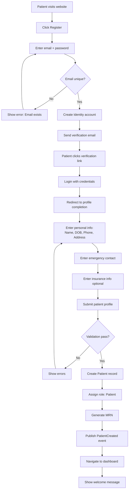
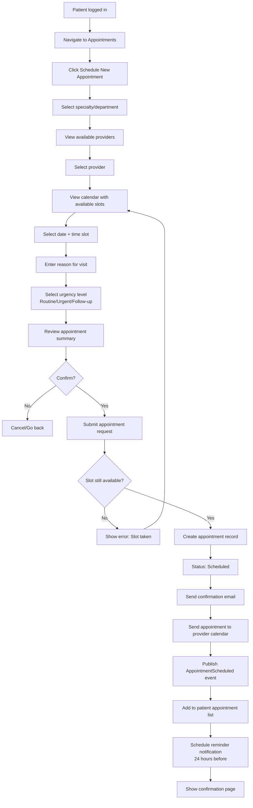
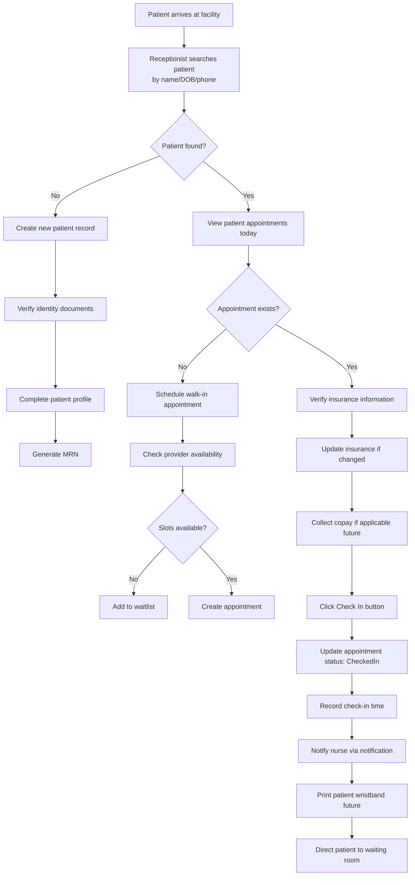
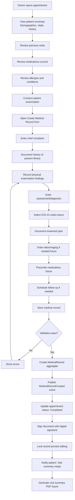
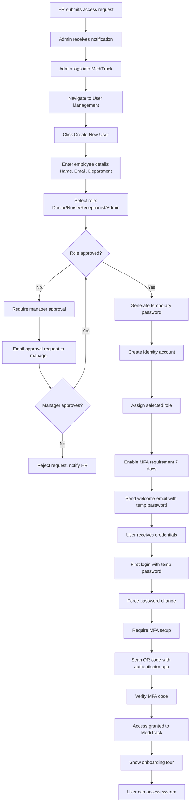

# MediTrack — Business Logic, Workflows & Use Cases

## Table of Contents

1. [Business Overview](#business-overview)
2. [User Roles & Personas](#user-roles--personas)
3. [Core Business Rules](#core-business-rules)
4. [Workflows](#workflows)
5. [Use Cases](#use-cases)
6. [Business Validations](#business-validations)
7. [Integration Points](#integration-points)

---

## Business Overview

### Mission Statement

MediTrack is a comprehensive healthcare management platform designed to streamline patient care coordination, medical record management, and appointment scheduling across healthcare facilities.

### Business Objectives

- **Improve Patient Care Coordination** — Centralized patient records accessible to authorized medical staff
- **Reduce Administrative Overhead** — Automated appointment scheduling and reminder notifications
- **Ensure Compliance** — Audit trails, role-based access control, and secure data handling
- **Enable Data-Driven Decisions** — Analytics on appointment patterns, patient demographics, and treatment outcomes
- **Enhance Patient Experience** — Self-service appointment booking, medical record access, and secure communication

### Key Capabilities

| Capability | Description | Phase |
|------------|-------------|-------|
| **Patient Management** | Registration, profile management, search, activation/deactivation | Phase 5 ✓ |
| **Appointment Scheduling** | Book, reschedule, cancel appointments with medical staff | Phase 6 |
| **Medical Records** | Create, view, update patient medical history and diagnoses | Phase 7 |
| **Identity & Access Management** | User authentication, role-based authorization, MFA | Phase 4 ✓ |
| **Notifications** | Real-time alerts for appointments, test results, messages | Phase 8 |
| **Audit & Compliance** | Complete audit trail of all data access and modifications | Phase 4 ✓ |

---

## User Roles & Personas

### 1. **Patient**

**Description**: End-user receiving medical care

**Permissions**:
- View own profile and medical records
- Book/cancel appointments
- View appointment history
- Update contact information
- Receive notifications

**Typical User Journey**:
1. Register account with email verification
2. Complete patient profile (demographics, insurance, emergency contact)
3. Book appointment with available provider
4. Receive appointment confirmation and reminders
5. Check in for appointment (future: QR code/kiosk)
6. View test results and medical records after visit
7. Book follow-up appointments as needed

---

### 2. **Doctor**

**Description**: Medical professional providing patient care

**Permissions**:
- View all patient medical records
- Create/update medical records and diagnoses
- View and manage own appointment schedule
- Prescribe medications (future)
- Order lab tests (future)
- View audit logs for accessed records

**Typical User Journey**:
1. Log in to MediTrack at start of day
2. Review daily appointment schedule
3. Access patient medical history before appointments
4. Document visit notes, diagnoses, and treatment plans
5. Order tests or prescribe medications
6. Schedule follow-up appointments
7. Review pending test results and patient messages

---

### 3. **Nurse**

**Description**: Medical staff assisting with patient care

**Permissions**:
- View patient medical records (limited)
- Record vital signs and triage information
- View appointment schedules
- Update appointment status (checked-in, in-progress, completed)
- Send patient notifications

**Typical User Journey**:
1. Review daily patient appointment list
2. Check in arriving patients
3. Record vital signs (blood pressure, temperature, weight, height)
4. Perform triage and update urgency level
5. Prepare patient charts for doctor review
6. Follow up on post-appointment instructions with patients

---

### 4. **Receptionist**

**Description**: Administrative staff managing front desk operations

**Permissions**:
- Create/update patient profiles
- Schedule/reschedule appointments for all providers
- View appointment calendar (all providers)
- Check patients in/out
- Verify insurance information
- Generate appointment reports

**Typical User Journey**:
1. Log in to front desk terminal
2. Check in arriving patients (verify identity, insurance)
3. Answer phone calls and schedule appointments
4. Handle walk-in appointment requests
5. Coordinate with medical staff on schedule changes
6. Process patient registrations for new patients
7. Generate daily appointment reports

---

### 5. **Admin**

**Description**: System administrator with full access

**Permissions**:
- Manage user accounts (create, deactivate, reset passwords)
- Assign and modify user roles
- Configure system settings
- View all audit logs
- Generate compliance reports
- Manage facility information and provider schedules

**Typical User Journey**:
1. Monitor system health and security alerts
2. Process user access requests (new hires, role changes)
3. Review audit logs for compliance
4. Configure notification templates
5. Generate monthly reports for management
6. Perform user training on new features

---

## Core Business Rules

> **Implementation Status Legend**:
> - ✓ **Implemented** — Rule is enforced in code (Phase 5)
> - 📋 **Planned** — Documented but not yet implemented
> - ⏳ **Future** — Deferred to later phases

### Patient Registration

| Rule ID | Rule | Rationale | Status |
|---------|------|-----------|--------|
| BR-P001 | Email must be unique across all patients | Prevents duplicate accounts, enables email-based communication | ✓ Implemented |
| BR-P002 | Date of birth must be in the past | Data validation | ✓ Implemented |
| BR-P003 | Phone number must be valid format (10+ digits) | Ensures contact reliability | ✓ Implemented |
| BR-P004 | Patient must be at least 1 day old | Newborn records created by medical staff, not self-registration | ✓ Implemented |
| BR-P005 | Emergency contact is optional but recommended | Flexibility for patients, but encouraged for safety | ✓ Implemented |
| BR-P006 | Medical Record Number (MRN) auto-generated on creation | Prevents duplicates, ensures unique identifier | ✓ Implemented |
| BR-P007 | Insurance info can be added later | Don't block registration, can update at check-in | ✓ Implemented |
| BR-P008 | Inactive patients cannot book appointments | Business rule to prevent scheduling for closed accounts | ✓ Implemented |
| BR-P009 | Only Admin or Receptionist can deactivate patients | Prevents accidental self-deactivation | ✓ Implemented |
| BR-P010 | Name fields allow only letters, spaces, hyphens, apostrophes | Data quality and security (prevent injection) | ✓ Implemented |

### Appointment Scheduling

> **Note**: Appointment service implementation planned for Phase 6. Rules defined for future implementation.

| Rule ID | Rule | Rationale | Status |
|---------|------|-----------|--------|
| BR-A001 | Appointments must be scheduled at least 1 hour in advance | Prevents last-minute scheduling, allows preparation time | ⏳ Future (Phase 6) |
| BR-A002 | Appointment slots are 15-minute increments | Standard medical practice, allows flexibility | ⏳ Future (Phase 6) |
| BR-A003 | Maximum 6 months advance booking | Reasonable planning horizon, prevents indefinite holds | ⏳ Future (Phase 6) |
| BR-A004 | Cannot double-book same provider at same time | Physical constraint | ⏳ Future (Phase 6) |
| BR-A005 | Patient can have max 3 active appointments at once | Prevents abuse, allows for specialist + follow-up scheduling | ⏳ Future (Phase 6) |
| BR-A006 | Cancellations require reason for audit | Compliance and analytics | ⏳ Future (Phase 6) |
| BR-A007 | Appointments auto-cancel if patient no-shows 3 times | Reduce no-show rate, free up slots | ⏳ Future (Phase 6) |
| BR-A008 | Urgent appointments (triage critical) prioritized | Patient safety | ⏳ Future (Phase 6) |
| BR-A009 | Rescheduling allowed up to 24 hours before appointment | Balances flexibility with scheduling efficiency | ⏳ Future (Phase 6) |
| BR-A010 | Only active patients can book appointments | Business rule consistency with patient status | ⏳ Future (Phase 6) |

> **Note**: Medical Records service implementation planned for Phase 7. Rules defined for future implementation.

| Rule ID | Rule | Rationale | Status |
|---------|------|-----------|--------|
| BR-M001 | Medical records cannot be deleted, only amended | Regulatory compliance (HIPAA) | ⏳ Future (Phase 7) |
| BR-M002 | All record access is logged with timestamp and user | Audit trail for compliance | ⏳ Future (Phase 7) |
| BR-M003 | Only treating doctor/nurse can create records for appointment | Ensures accountability | ⏳ Future (Phase 7) |
| BR-M004 | Patient can view own records but not edit | Transparency but prevent tampering | ⏳ Future (Phase 7) |
| BR-M005 | Diagnosis codes must be valid ICD-10 codes (future) | Standardization for billing and analytics | ⏳ Future (Phase 8+) |
| BR-M006 | Amendments require reason and approver signature | Audit trail integrity | ⏳ Future (Phase 7) |
| BR-M007 | Sensitive records can be flagged for additional access control | Privacy for mental health, substance abuse, etc. | ⏳ Future (Phase 8+) |
| BR-M008 | Lab results auto-attach to medical record | Workflow efficiency | ⏳ Future (Phase 8+)integrity |
| BR-M007 | Sensitive records can be flagged for additional access control | Privacy for mental health, substance abuse, etc. |
| BR-M008 | Lab results auto-attach to medical record | Workflow efficiency |

### Security & Access Control Status |
|---------|------|-----------|--------|
| BR-S001 | Users must have MFA enabled after 7 days | Security compliance | ⏳ Future (MFA design complete, implementation Phase 6) |
| BR-S002 | Failed login attempts (5+) lock account for 15 minutes | Prevent brute force attacks | ✓ Implemented (IdentityServer config) |
| BR-S003 | Password must be 12+ chars with complexity requirements | Industry best practice | ✓ Implemented (Identity.API) |
| BR-S004 | Access tokens expire after 1 hour, refresh tokens after 14 days | Balance security and user experience | ✓ Implemented (IdentityServer config) |
| BR-S005 | Users automatically logged out after 30 minutes of inactivity | Prevent unauthorized access on shared terminals | ⏳ Future (Phase 6 - frontend implementation) |
| BR-S006 | Role changes require Admin approval | Prevent privilege escalation | 📋 Planned (simple role assignment exists) |
| BR-S007 | All data access logged with IP address and device info | Forensic capability | ✓ Implemented (Audit infrastructure Phase 4) |
| BR-S008 | Sharing login credentials is immediate termination | Accountability and compliance | Policy (not system-enforced)
| BR-S007 | All data access logged with IP address and device info | Forensic capability |
| BR-S008 | Sharing login credentials is immediate termination | Accountability and compliance |

---

## Workflows

### Workflow 1: New Patient Registration (Self-Service)

**Actors**: Patient, Identity.API, Patient.API

**Estimated Duration**: 5-10 minutes

**Success Criteria**:
- Patient account created with verified email
- Patient role assigned
- MRN generated and stored
- Dashboard accessible

---

### Workflow 2: Schedule Appointment (Patient-Initiated)

**Actors**: Patient, Appointment.API, Notification.Worker

**Estimated Duration**: 2-5 minutes

**Success Criteria**:
- Appointment created and confirmed
- Patient receives email confirmation
- Provider calendar updated
- Reminder notification scheduled

**Failure Scenarios**:
- Slot no longer available → Prompt to select different time
- Provider unavailable (vacation, sick) → Show message, suggest alternatives
- Patient has 3 active appointments → Block scheduling, show message

---

### Workflow 3: Patient Check-In (Receptionist)

**Actors**: Receptionist, Patient, Appointment.API, Patient.API, Notification.Worker

**Estimated Duration**: 3-7 minutes

**Success Criteria**:
- Patient checked in and recorded
- Nurse notified of patient arrival
- Appointment status updated
- Insurance verified

---

### Workflow 4: Medical Record Documentation (Doctor)

**Actors**: Doctor, MedicalRecords.API, Appointment.API, Notification.Worker

**Estimated Duration**: 10-20 minutes per visit

**Success Criteria**:
- Medical record created and saved
- Appointment marked completed
- Patient notified of completed visit
- Record immutable (amendments only)

---

### Workflow 5: User Access Request (New Employee Onboarding)

**Actors**: Admin, HR, Manager, New User, Identity.API

**Estimated Duration**: 5-10 minutes (admin), 5 minutes (user setup)

**Success Criteria**:
- User account created with correct role
- Temporary password provided
- MFA enforced
- User successfully logs in

---

## Use Cases

### UC-001: Patient Self-Registration

**Actor**: Patient (unauthenticated)

**Preconditions**:
- Patient has valid email address
- Patient has internet access

**Main Flow**:
1. Patient navigates to MediTrack website
2. Patient clicks "Register" link
3. System displays registration form (email + password)
4. Patient enters email and password (12+ chars)
5. System validates email is unique
6. System validates password complexity
7. System creates Identity account
8. System sends verification email
9. Patient opens email and clicks verification link
10. System marks email as verified
11. System redirects to login page
12. Patient logs in with credentials
13. System redirects to profile completion form
14. Patient enters: First name, Last name, Date of Birth, Gender, Phone, Address
15. Patient optionally enters: Emergency contact, Insurance information
16. Patient clicks "Complete Registration"
17. System validates all required fields
18. System creates Patient record with status: Active
19. System generates Medical Record Number (MRN)
20. System assigns "Patient" role to user
21. System publishes `PatientRegistered` integration event
22. System navigates to dashboard
23. System displays welcome message

**Postconditions**:
- Patient account created and active
- Patient can book appointments
- Patient can view own medical records (when created)

**Alternative Flows**:

**A1: Email Already Exists**
- At step 5, if email exists:
  - System shows error: "Email already registered"
  - System suggests "Forgot Password" link
  - Patient can reset password or use different email

**A2: Email Verification Expired**
- If verification link clicked after 24 hours:
  - System shows error: "Verification link expired"
  - System offers to resend verification email
  - Patient receives new email

**A3: Profile Validation Fails**
- At step 17, if validation fails:
  - System highlights invalid fields
  - System shows specific error messages
  - Patient corrects errors and resubmits

**Exception Flows**:

**E1: Network Error During Registration**
- System displays error message
- System saves partial progress (if email/password created)
- Patient can resume registration after login

**Business Rules Applied**:
- BR-P001: Email uniqueness
- BR-P002: DOB in past
- BR-P003: Phone format validation
- BR-P006: MRN auto-generation
- BR-S003: Password complexity

---

### UC-002: Schedule Appointment (Patient)

**Actor**: Patient (authenticated)

**Preconditions**:
- Patient logged in
- Patient account is Active
- Patient has fewer than 3 active appointments

**Main Flow**:
1. Patient navigates to "Appointments" page
2. System displays patient's upcoming and past appointments
3. Patient clicks "Schedule New Appointment"
4. System displays specialty/department selection
5. Patient selects specialty (e.g., "General Practice", "Cardiology")
6. System displays list of available providers in that specialty
7. Patient selects a provider
8. System displays calendar with provider's available time slots (next 6 months)
9. Patient selects desired date
10. System shows available time slots for that date (15-min increments)
11. Patient selects a time slot
12. System displays appointment booking form
13. Patient enters reason for visit (free text)
14. Patient selects urgency: Routine / Urgent / Follow-up
15. Patient reviews appointment summary (provider, date, time, reason)
16. Patient clicks "Confirm Appointment"
17. System validates slot is still available
18. System creates appointment with status: Scheduled
19. System sends confirmation email to patient
20. System updates provider's calendar
21. System schedules reminder notification (24 hours before)
22. System publishes `AppointmentScheduled` event
23. System displays confirmation page with appointment details
24. System offers option to add to personal calendar (iCal/Google)

**Postconditions**:
- Appointment created and confirmed
- Patient receives confirmation email
- Provider sees appointment in their schedule
- Reminder notification queued

**Alternative Flows**:

**A1: Slot No Longer Available**
- At step 17, if slot was booked by someone else:
  - System shows error: "Selected time is no longer available"
  - System redirects to step 10 (select different time)
  - System highlights unavailable slot in gray

**A2: Patient Has Maximum Active Appointments**
- At step 3, if patient has 3 active appointments:
  - System shows message: "You have reached the maximum number of active appointments (3). Please cancel or complete an existing appointment before scheduling a new one."
  - System displays list of active appointments with "Cancel" option
  - Use case ends

**A3: Provider Unavailable on Selected Date**
- At step 10, if provider has no availability:
  - System shows message: "No available slots on this date"
  - System suggests next available dates
  - Patient selects different date

**Exception Flows**:

**E1: Appointment Request Timeout**
- If step 17 takes longer than 30 seconds:
  - System shows error: "Request timed out, please try again"
  - System does NOT create appointment
  - Patient can retry from step 3

**Business Rules Applied**:
- BR-A001: 1 hour advance booking minimum
- BR-A002: 15-minute slot increments
- BR-A003: 6-month maximum advance booking
- BR-A004: No double-booking
- BR-A005: Max 3 active appointments per patient
- BR-P008: Only active patients can book

---

### UC-003: Check In Patient (Receptionist)

**Actor**: Receptionist (authenticated)

**Preconditions**:
- Receptionist logged in
- Patient has scheduled appointment for today
- Patient present at facility

**Main Flow**:
1. Receptionist clicks "Check In Patient"
2. System displays patient search form
3. Receptionist enters search criteria (name, DOB, phone, or MRN)
4. System searches patient database
5. System displays matching patient(s)
6. Receptionist selects correct patient
7. System displays patient profile and today's appointments
8. Receptionist verifies patient identity (asks for ID)
9. Receptionist selects the appointment to check in
10. System displays appointment details
11. Receptionist asks patient to verify/update:
    - Contact phone number
    - Address
    - Emergency contact
    - Insurance information
12. Receptionist updates any changed information
13. System validates updates
14. Receptionist clicks "Check In" button
15. System updates appointment status: CheckedIn
16. System records check-in timestamp
17. System publishes `PatientCheckedIn` event
18. System sends notification to assigned nurse
19. System displays check-in confirmation
20. Receptionist directs patient to waiting room

**Postconditions**:
- Appointment status updated to CheckedIn
- Nurse notified of patient arrival
- Patient contact information current
- Check-in timestamp recorded

**Alternative Flows**:

**A1: Patient Not Found**
- At step 5, if no matching patients:
  - System shows "No patients found"
  - Receptionist asks if this is new patient
  - If yes, receptionist creates new patient record (see UC-004)
  - If no, receptionist tries different search criteria

**A2: No Appointment Found for Today**
- At step 7, if patient has no appointments today:
  - System shows message: "No appointments scheduled for today"
  - Receptionist asks if patient wants walk-in appointment
  - If yes, receptionist creates walk-in appointment (see alternative flow A3)
  - If no, receptionist schedules future appointment

**A3: Walk-In Appointment**
- Patient arrives without scheduled appointment:
  - Receptionist checks provider availability
  - If slots available: Create appointment with "Walk-In" type
  - If no slots available: Add patient to waitlist
  - Notify patient of estimated wait time

**A4: Patient Arrives Late (More Than 15 Minutes)**
- At step 10, if current time is 15+ minutes past appointment time:
  - System shows warning: "Patient is late"
  - Receptionist checks provider schedule
  - If provider can still accommodate: Proceed with check-in
  - If provider is now with another patient: Offer to reschedule

**Exception Flows**:

**E1: Insurance Verification Fails**
- If insurance information cannot be verified:
  - Receptionist notes insurance status as "Pending Verification"
  - Proceeds with check-in
  - Patient responsible for payment at checkout
  - Receptionist follows up on insurance verification

**Business Rules Applied**:
- BR-P008: Only active patients can have appointments
- BR-A010: Appointment must exist to check in

---

### UC-004: Create Medical Record (Doctor)

**Actor**: Doctor (authenticated)

**Preconditions**:
- Doctor logged in
- Patient checked in for appointment
- Appointment assigned to doctor

**Main Flow**:
1. Doctor opens appointment from schedule
2. System displays patient summary dashboard:
   - Demographics (name, age, gender, MRN)
   - Vital signs (from nurse triage)
   - Allergies and conditions (red alerts)
   - Current medications
   - Previous visit summary
3. Doctor reviews patient history
4. Doctor conducts physical examination (offline)
5. Doctor clicks "Create Medical Record"
6. System displays medical record form
7. Doctor enters:
   - Chief Complaint (e.g., "Persistent cough for 2 weeks")
   - History of Present Illness (HPI)
   - Review of Systems (ROS)
   - Physical Examination findings
   - Assessment/Diagnosis
   - Treatment Plan
   - Medications prescribed (future integration)
   - Lab/imaging orders (future integration)
   - Follow-up instructions
8. Doctor clicks "Save Draft" (optional, can save progress)
9. Doctor completes all required fields
10. Doctor clicks "Finalize Record"
11. System validates all required sections completed
12. System creates MedicalRecord aggregate with domain events
13. System generates unique Record ID
14. System associates record with Patient and Appointment
15. System publishes `MedicalRecordCreated` event
16. System updates appointment status: Completed
17. System captures digital signature (doctor's user ID + timestamp)
18. System locks record (immutable, amendments only)
19. System sends notification to patient: "Your visit summary is ready"
20. System displays confirmation message
21. Doctor can generate patient handout (future: print visit summary)

**Postconditions**:
- Medical record created and stored
- Record immutable (signed and locked)
- Appointment marked completed
- Patient notified
- Audit log entry created

**Alternative Flows**:

**A1: Save Draft and Resume Later**
- At step 8, doctor saves draft:
  - System saves partial record with status: Draft
  - Doctor can close form
  - Draft appears in doctor's "Pending Documentation" list
  - Doctor can resume from any device
  - Draft auto-deleted if not finalized within 7 days

**A2: Amend Existing Record**
- Doctor needs to correct finalized record:
  - Doctor opens completed record (read-only)
  - Doctor clicks "Create Amendment"
  - System creates new Amendment entity linked to original
  - Doctor enters: Reason for amendment, Changes made
  - System requires approval from another doctor (peer review)
  - Amendment appears in patient record with clear marker
  - Original record remains unchanged

**A3: Add Addendum (Additional Information)**
- Doctor needs to add information after finalizing:
  - Similar to amendment, but doesn't change original
  - Doctor adds supplementary notes
  - Addendum timestamped and linked to original record

**Exception Flows**:

**E1: Validation Errors**
- At step 11, if required fields missing:
  - System highlights incomplete sections in red
  - System shows error summary at top
  - Doctor completes missing information
  - System allows save as draft

**E2: Session Timeout During Documentation**
- If doctor's session expires during documentation:
  - System auto-saves draft every 2 minutes
  - On re-login, system prompts: "You have unsaved work, resume?"
  - Doctor can resume from last auto-save point

**Business Rules Applied**:
- BR-M001: Records cannot be deleted
- BR-M002: All access logged
- BR-M003: Only treating doctor can create record for appointment
- BR-M006: Amendments require reason

---

### UC-005: Deactivate Patient Account (Admin)

**Actor**: Admin (authenticated)

**Preconditions**:
- Admin logged in
- Patient account exists
- Patient account is currently Active

**Main Flow**:
1. Admin navigates to "Patient Management"
2. Admin searches for patient by name, email, or MRN
3. System displays search results
4. Admin selects patient to deactivate
5. System displays patient profile
6. Admin clicks "Deactivate Patient"
7. System displays confirmation dialog:
   - "Are you sure you want to deactivate [Patient Name]?"
   - "Reason for deactivation:"
   - Text field for admin notes
8. Admin selects reason: Deceased / Moved / Duplicate / Other
9. Admin enters additional notes
10. Admin clicks "Confirm Deactivation"
11. System validates admin has permission
12. System updates patient status: Inactive
13. System cancels all future appointments for this patient
14. System sends cancellation notifications to affected providers
15. System publishes `PatientDeactivated` event
16. System logs deactivation with admin user ID, timestamp, and reason
17. System displays confirmation: "Patient deactivated successfully"
18. Patient can no longer log in (account disabled in Identity service)
19. Patient's medical records remain accessible to medical staff (read-only)

**Postconditions**:
- Patient account status: Inactive
- Patient cannot log in
- Future appointments cancelled
- Medical records preserved (read-only)
- Audit log entry created

**Alternative Flows**:

**A1: Patient Has Upcoming Appointments**
- At step 12, if patient has appointments in next 7 days:
  - System shows warning: "Patient has [N] upcoming appointments in the next 7 days"
  - System lists appointments with dates and providers
  - Admin can choose to:
    - Cancel all appointments automatically
    - Keep appointments and deactivate after last appointment
    - Cancel deactivation and manually reschedule appointments first

**A2: Reactivate Previously Deactivated Patient**
- Patient returns and wants to reactivate:
  - Admin searches for patient (system shows inactive patients)
  - Admin clicks "Reactivate Patient"
  - System prompts for reason
  - System updates status back to Active
  - System re-enables login
  - System publishes `PatientReactivated` event
  - Patient receives email: "Your account has been reactivated"

**Exception Flows**:

**E1: Patient Has Active Appointments**
- If appointments are currently in-progress or checked-in:
  - System blocks deactivation
  - System shows error: "Cannot deactivate patient with active appointments. Please complete or cancel appointments first."

**E2: Insufficient Permissions**
- If non-Admin user attempts deactivation:
  - System shows error: "Insufficient permissions. Only administrators can deactivate patient accounts."
  - Action blocked at API level

**Business Rules Applied**:
- BR-P008: Inactive patients cannot book appointments
- BR-P009: Only Admin or Receptionist can deactivate
- BR-M002: All access logged

---

## Business Validations

### Patient Profile Validations

> **Phase 5 Implementation Status**: Most validations implemented via FluentValidation. Some are documented targets.

| Field | Validation Rules | Error Message | Status |
|-------|------------------|---------------|--------|
| **First Name** | Required, 1-50 chars, letters/hyphens/spaces only | "First name is required and must be 1-50 characters" | ⚠️ Partial (length ✓, chars 📋) |
| **Last Name** | Required, 1-50 chars, letters/hyphens/spaces only | "Last name is required and must be 1-50 characters" | ⚠️ Partial (length ✓, chars 📋) |
| **Date of Birth** | Required, valid date, in past, patient at least 1 day old | "Invalid date of birth" | ⚠️ Partial (past ✓, 1-day 📋) |
| **Email** | Required, valid email format, unique | "Email is required and must be unique" | ✓ Implemented |
| **Phone Number** | Required, 10+ digits, valid phone format | "Phone number must be at least 10 digits" | ✓ Implemented |
| **Address** | Required, 1-200 chars | "Address is required" | ✓ Implemented |
| **Gender** | Optional, one of: Male/Female/Other/Prefer not to say | N/A | ✓ Implemented |
| **Emergency Contact** | Optional, max 500 chars | "Emergency contact is too long (max 500 characters)" | ✓ Implemented |
| **Insurance Info** | Optional, max 1000 chars | "Insurance info is too long (max 1000 characters)" | ✓ Implemented |
| **Medical Record Number** | Auto-generated, unique, format: MRN-YYYYMMDD-XXXX | N/A (system-generated) | 📋 Planned (currently optional user input) |

### Appointment Validations

| Field | Validation Rules | Error Message |
|-------|------------------|---------------|
| **Patient ID** | Required, must exist, patient must be Active | "Invalid patient" |
| **Provider ID** | Required, must exist, provider must be Active | "Invalid provider" |
| **Appointment Date** | Required, must be today or future, within 6 months | "Appointment date must be within the next 6 months" |
| **Appointment Time** | Required, 15-min increment, at least 1 hour from now | "Appointments must be scheduled at least 1 hour in advance" |
| **Duration** | Default 30 minutes, can be 15/30/45/60 | "Invalid duration" |
| **Reason** | Required, 1-500 chars | "Reason for visit is required" |
| **Urgency** | Required, one of: Routine/Urgent/Critical | "Urgency level is required" |
| **Status** | One of: Scheduled/CheckedIn/InProgress/Completed/Cancelled/NoShow | "Invalid status" |
| **Overlap Check** | No existing appointment for same provider at same time | "Provider is not available at this time" |
| **Patient Limit** | Patient has fewer than 3 active appointments | "You have reached the maximum of 3 active appointments" |

### Medical Record Validations

| Field | Validation Rules | Error Message |
|-------|------------------|---------------|
| **Patient ID** | Required, must exist | "Invalid patient" |
| **Appointment ID** | Optional, if provided must exist and belong to patient | "Invalid appointment" |
| **Chief Complaint** | Required, 1-500 chars | "Chief complaint is required" |
| **Diagnosis** | Required, 1-2000 chars | "Diagnosis is required" |
| **Treatment Plan** | Required, 1-2000 chars | "Treatment plan is required" |
| **Doctor ID** | Required, must be user with Doctor role | "Invalid doctor" |
| **Record Date** | Auto-set to current date/time | N/A |
| **Signature** | Auto-captured (doctor user ID + timestamp) | N/A |

---

## Integration Points

### Inter-Service Communication

> **Phase 5 Implementation Status**:
> - ✓ **Implemented**: PatientRegistered event published and consumed
> - ✓ **Implemented**: PatientDeactivated event published with transaction rollback protection
> - ✓ **Implemented**: Audit logging infrastructure operational
> - ⏳ **Future**: All appointment and medical record events (Phase 6-7)

| Source Service | Event Published | Target Service | Action Taken | Status |
|----------------|-----------------|----------------|--------------|--------|
| **Patient.API** | `PatientRegistered` | Notification.Worker | Send welcome email | ✓ Implemented |
| **Patient.API** | `PatientDeactivated` | Appointment.API | Cancel future appointments | ✓ Implemented |
| **Appointment.API** | `AppointmentScheduled` | Notification.Worker | Send confirmation email + schedule reminder | ⏳ Future (Phase 6) |
| **Appointment.API** | `AppointmentCancelled` | Notification.Worker | Send cancellation notification | ⏳ Future (Phase 6) |
| **Appointment.API** | `PatientCheckedIn` | Notification.Worker | Notify nurse of patient arrival | ⏳ Future (Phase 6) |
| **MedicalRecords.API** | `MedicalRecordCreated` | Notification.Worker | Notify patient visit summary ready | ⏳ Future (Phase 7) |
| **MedicalRecords.API** | `MedicalRecordCreated` | Appointment.API | Update appointment status to Completed | ⏳ Future (Phase 7) |
| **Identity.API** | `UserLoggedIn` | Audit.API | Log authentication event | ✓ Implemented |
| **Identity.API** | `MfaEnabled` | Notification.Worker | Send confirmation email | ⏳ Future (Phase 6) |
| **All Services** | `*` (any data access) | Audit.API | Log all data access for compliance | ✓ Implemented |

### External Integrations (Future)

| System | Integration Type | Purpose |
|--------|------------------|---------|
| **Insurance Eligibility Verification** | REST API | Real-time insurance verification at check-in |
| **Lab Systems** | HL7 FHIR | Import lab results into medical records |
| **Pharmacy** | E-Prescribe (NCPDP) | Send prescriptions electronically |
| **Imaging (PACS)** | DICOM | Retrieve radiology images |
| **Email Provider** | SMTP/SendGrid | Transactional emails and notifications |
| **SMS Provider** | Twilio | Appointment reminders and alerts |
| **Payment Gateway** | Stripe | Process copays and payments |
| **Telehealth Platform** | WebRTC/Zoom API | Virtual appointments |

---

## Compliance & Regulatory Considerations

### HIPAA Compliance

- **Access Control**: Role-based access, minimum necessary principle
- **Audit Trails**: All PHI access logged with user, timestamp, IP address
- **Encryption**: Data encrypted at rest (database) and in transit (TLS 1.3)
- **Data Retention**: Medical records retained for 7 years (state-dependent)
- **Breach Notification**: Automated alerts for suspicious access patterns
- **Business Associate Agreements**: Required for all third-party integrations

### Security Standards

- **OWASP Top 10**: Addressed in application security design
- **PCI DSS**: If processing payments (future)
- **SOC 2 Type II**: Audit for security, availability, confidentiality

### Data Privacy

- **Patient Rights**: Right to access, correct, and delete personal data
- **Consent Management**: Track patient consent for data sharing
- **Anonymization**: Analytics and reporting use de-identified data

---

## Metrics & KPIs

### Operational Metrics

- **Average Check-In Time**: Target < 5 minutes
- **Appointment No-Show Rate**: Target < 10%
- **Patient Registration Completion Rate**: % who complete profile after account creation
- **Provider Schedule Utilization**: % of available slots filled
- **Average Wait Time**: Time from check-in to seen by provider

### Quality Metrics

- **Medical Record Completion Rate**: % of appointments with completed records within 24 hours
- **Patient Satisfaction Score**: Post-appointment survey (CSAT/NPS)
- **Record Amendment Rate**: % of records requiring amendments (quality indicator)

### Security Metrics

- **Failed Login Attempts**: Monitor for brute force attacks
- **MFA Adoption Rate**: % of users with MFA enabled
- **Unauthorized Access Attempts**: Audit log violations
- **Average Time to Detect Security Breach**: Target < 24 hours

---

## Future Enhancements

### Phase 6-10 Planned Features

1. **Telemedicine** — Virtual appointments with video conferencing
2. **Patient Portal Enhancements** — Secure messaging, bill pay, document upload
3. **Prescription Management** — E-prescribe integration, medication reconciliation
4. **Lab/Imaging Integration** — Automated result imports, image viewing
5. **Advanced Scheduling** — Recurring appointments, group appointments, resource booking
6. **Analytics Dashboard** — Predictive analytics, population health insights
7. **Mobile App** — Native iOS/Android apps for patients and providers
---

## Implementation Notes (Phase 5 — Current)

### What's Actually Implemented ✓

**Patient Management (Phase 5)**:
- ✓ Create patient with registration
- ✓ Update patient profile (limited fields: name, email, phone, address, emergency contact)
- ✓ Search patients by name, email, phone
- ✓ Soft delete (deactivate/activate) with IsActive flag
- ✓ Email uniqueness validation
- ✓ `PatientRegistered` integration event published and consumed
- ✓ Audit logging for all patient data access

**Identity & Auth (Phase 4)**:
- ✓ User registration with email + password
- ✓ Role-based authorization (Patient, Doctor, Nurse, Receptionist, Admin)
- ✓ JWT access tokens (1-hour expiry)
- ✓ Refresh tokens (14-day expiry)
- ✓ Password complexity requirements (12+ chars)
- ✓ Failed login attempt lockout (IdentityServer default: 5 attempts = 5 min lockout)
- ⚠️ Email verification deliberately skipped (auto sign-in after registration)

**Frontend (Phase 5)**:
- ✓ Patient list with search and filter (active/inactive)
- ✓ Patient detail view
- ✓ Patient create/edit forms with react-hook-form + Zod validation
- ✓ Layout with navigation sidebar
- ✓ OIDC authentication flow with react-oidc-context
- ✓ RTK Query for API state management

### Recently Implemented (Feb 2026)

**All Phase 5 known gaps have been completed:**

1. **BR-P009**: Role-gated deactivate ✓
   - **Implemented**: `.RequireAuthorization(AuthorizationPolicies.RequireAdminOrReceptionist)` on DeactivatePatient and ActivatePatient endpoints
   - **File**: `Patient.API/Apis/PatientsApi.cs` lines 53, 61

2. **BR-P006**: MRN auto-generation ✓
   - **Implemented**: System-generated format `MRN-{YYYYMMDD}-{XXXXXXXX}` (8-char hex from GUID)
   - **Files**: `Patient.API/Models/Patient.cs`, `PatientConfiguration.cs` (unique index)
   - **Database migration required**: `dotnet ef migrations add AddMedicalRecordNumber`

3. **PatientDeactivated event** ✓
   - **Implemented**: Event published in `DeactivateAsync` with transaction rollback protection
   - **Files**: `MediTrack.Shared/Events/PatientIntegrationEvents.cs`, `Patient.API/Services/PatientService.cs`
   - **Pattern**: Wrapped in `BeginTransactionAsync` → `CommitAsync` / `RollbackAsync`

4. **BR-P004**: 1-day minimum age validation ✓
   - **Implemented**: 
     - Backend: FluentValidation `.Must(dob => dob <= DateOnly.FromDateTime(DateTime.Today.AddDays(-1)))`
     - Frontend: Zod `.refine()` with same logic + `max` attribute on date input
   - **Files**: `Patient.API/Validators/PatientValidators.cs`, `MediTrack.Web/src/features/patients/components/PatientForm.tsx`

5. **BR-P010**: Name character restriction ✓
   - **Implemented**: Regex `^[a-zA-Z\s'-]+$` (hyphen at end of character class, unescaped)
   - **Files**: 
     - Backend: `Patient.API/Validators/PatientValidators.cs` (FirstName, LastName)
     - Frontend: `PatientForm.tsx` (NAME_PATTERN constant)

**Code Quality Improvements:**
- Fixed regex escape: `-` moved to end of character class to avoid ambiguity
- Removed unused `Reason` property from `PatientDeactivatedIntegrationEvent`
- Fixed double semicolon typo in `Patient.cs`
- Frontend form rewrite: Structured address/emergency contact/insurance fields with toggle buttons
- Added "Non-Binary" gender option to match backend `ValidGenders` array
- DateOfBirth + Gender now required on edit (matches backend `UpdatePatientRequest`)

### Deliberately Deferred

- **Email verification**: Skipped to simplify onboarding (commented in code)
- **Appointment scheduling** (BR-A001 to BR-A010): Phase 6
- **Medical records** (BR-M001 to BR-M008): Phase 7
- **MFA enforcement** (BR-S001): Design complete, implementation Phase 6

---

## Document Control

| Version | Date | Author | Changes |
|---------|------|--------|---------|
| 1.0 | 2026-02-24 | MediTrack Team | Initial business logic documentation covering Phase 5 implementation |
| 1.1 | 2026-02-24 | MediTrack Team | Added implementation status indicators, gap analysis, and Phase 5 actual vs. planned reconciliation |
| 1.2 | 2026-02-24 | MediTrack Team | Completed all planned Phase 5 gaps: BR-P004, BR-P006, BR-P009, BR-P010, and PatientDeactivated event. Added transaction rollback protection for deactivation. |

**Approval**:
- Product Owner: ___________________
- Compliance Officer: ___________________
- Medical Director: ___________________

**Next Review Date**: 2026-05-24 (Quarterly)

---

## Contributing to This Document

When implementing new business rules:
1. Update the status column from 📋 Planned → ✓ Implemented
2. Move the rule from "Known Gaps" to "What's Actually Implemented"
3. Add test evidence (unit test references or integration test scenarios)
4. Update the version number and changelog in Document Control
**Approval**:
- Product Owner: ___________________
- Compliance Officer: ___________________
- Medical Director: ___________________

**Next Review Date**: 2026-05-24 (Quarterly)
